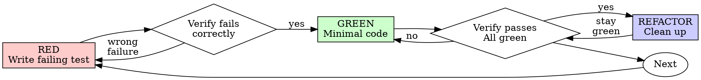

# Test-Driven Development (TDD)

## Overview

Write the test first. Watch it fail. Write minimal code to pass.

**Core principle:** If you didn't watch the test fail, you don't know if it tests the right thing.

**Violating the letter of the rules is violating the spirit of the rules.**

## When to Use

**Always:**
- New features
- Bug fixes
- Refactoring
- Behavior changes

**Exceptions (ask your human partner):**
- Throwaway prototypes
- Generated code
- Configuration files

Thinking "skip TDD just this once"? Stop. That's rationalization.

## ILX-First (Ruby/Rails Projects)

**Before writing any tests or code, check for ILX:**

```bash
# Check if ILX exists for the relevant files
ls .agentc/ilx/app/models/user.ilx
ls .agentc/ilx/app/controllers/posts_controller.ilx
```

**If ILX exists, read it first:**
- Understand entities, fields, relationships, constraints
- See existing features, triggers, edge cases
- Identify where new code fits in the domain
- Understand constraints that tests must verify

**Then write tests** that verify the semantic intent from ILX.

**If no ILX:** Proceed directly to writing tests. Consider running batch conversion:
```bash
cd plugins/agentc/scripts && ruby ilx_batch_convert.rb .
```

## Milk Quality Tiers

TDD applies at ALL tiers, but scope varies:

### SKIMMED (Bare Minimum)
```
Write happy case test FIRST → watch it FAIL → minimal code to PASS
```

- ONE test for the happy path
- That's it
- Use when: Exploratory code, low-risk features, time pressure

**JavaScript Example:**
```typescript
test('validates email format', () => {
  expect(isValidEmail('user@example.com')).toBe(true);
});
```

**Ruby/RSpec Example:**
```ruby
RSpec.describe EmailValidator do
  it 'validates email format' do
    expect(described_class.valid?('user@example.com')).to be true
  end
end
```

### SEMI-SKIMMED (Default)
```
Happy case test FIRST → essential sad cases → minimal extensible code
```

- Happy case test (write first)
- Essential sad cases (null, invalid input, auth failure)
- Code is extensible but not overengineered

**JavaScript Example:**
```typescript
// Happy case FIRST
test('validates email format', () => {
  expect(isValidEmail('user@example.com')).toBe(true);
});

// Essential sad cases
test('rejects empty email', () => {
  expect(isValidEmail('')).toBe(false);
});

test('rejects malformed email', () => {
  expect(isValidEmail('not-an-email')).toBe(false);
});
```

**Ruby/RSpec Example:**
```ruby
RSpec.describe EmailValidator do
  # Happy case FIRST
  it 'validates email format' do
    expect(described_class.valid?('user@example.com')).to be true
  end

  # Essential sad cases
  it 'rejects empty email' do
    expect(described_class.valid?('')).to be false
  end

  it 'rejects malformed email' do
    expect(described_class.valid?('not-an-email')).to be false
  end
end
```

### FULL PHAT (Production-Ready)
```
Happy → essential sad → non-essential sad → mad cases → logging → monitoring
```

- Happy case test (write first)
- Essential sad cases
- Non-essential sad cases (edge cases)
- Mad cases (race conditions, unexpected states)
- Add logging to implementation
- Add monitoring hooks

**JavaScript Example:**
```typescript
// Happy case FIRST
test('validates email format', () => { ... });

// Essential sad cases
test('rejects empty email', () => { ... });
test('rejects malformed email', () => { ... });

// Non-essential sad cases
test('rejects email with leading spaces', () => { ... });
test('rejects email with unicode lookalikes', () => { ... });

// Mad cases
test('handles concurrent validation calls', async () => { ... });
test('recovers from regex timeout', () => { ... });
```

Implementation includes:
```typescript
function isValidEmail(email: string): boolean {
  logger.debug('Validating email', { email: maskEmail(email) });
  metrics.increment('email_validation_attempts');

  // ... validation logic ...

  metrics.increment(result ? 'email_validation_success' : 'email_validation_failure');
  return result;
}
```

**Ruby/RSpec Example:**
```ruby
RSpec.describe EmailValidator do
  # Happy case FIRST
  it 'validates email format' do
    expect(described_class.valid?('user@example.com')).to be true
  end

  # Essential sad cases
  it 'rejects empty email' do
    expect(described_class.valid?('')).to be false
  end

  it 'rejects malformed email' do
    expect(described_class.valid?('not-an-email')).to be false
  end

  # Non-essential sad cases
  it 'rejects email with leading spaces' do
    expect(described_class.valid?(' user@example.com')).to be false
  end

  it 'rejects email with unicode lookalikes' do
    expect(described_class.valid?('user@exаmple.com')).to be false  # Cyrillic 'а'
  end

  # Mad cases
  it 'handles concurrent validation calls', :aggregate_failures do
    threads = 10.times.map { Thread.new { described_class.valid?('user@example.com') } }
    expect(threads.map(&:value)).to all(be true)
  end
end
```

Implementation includes:
```ruby
class EmailValidator
  def self.valid?(email)
    Rails.logger.debug("Validating email: #{email.gsub(/.(?=.{4})/, '*')}")
    StatsD.increment('email_validation_attempts')

    result = email.match?(URI::MailTo::EMAIL_REGEXP)

    StatsD.increment(result ? 'email_validation_success' : 'email_validation_failure')
    result
  end
end
```

### Tier Selection

- **Skimmed**: Prototypes, internal tools, low-risk
- **Semi-skimmed**: Most code (default)
- **Full phat**: User-facing, payment, auth, data integrity

**Still TDD at all tiers:** Write test first. Watch it fail. Write minimal code.

## The Iron Law

```
NO PRODUCTION CODE WITHOUT A FAILING TEST FIRST
```

Write code before the test? Delete it. Start over.

**No exceptions:**
- Don't keep it as "reference"
- Don't "adapt" it while writing tests
- Don't look at it
- Delete means delete

Implement fresh from tests. Period.

## Red-Green-Refactor



### RED - Write Failing Test

Write one minimal test showing what should happen.

<Good>
```typescript
test('retries failed operations 3 times', async () => {
  let attempts = 0;
  const operation = () => {
    attempts++;
    if (attempts < 3) throw new Error('fail');
    return 'success';
  };

  const result = await retryOperation(operation);

  expect(result).toBe('success');
  expect(attempts).toBe(3);
});
```
Clear name, tests real behavior, one thing
</Good>

<Bad>
```typescript
test('retry works', async () => {
  const mock = jest.fn()
    .mockRejectedValueOnce(new Error())
    .mockRejectedValueOnce(new Error())
    .mockResolvedValueOnce('success');
  await retryOperation(mock);
  expect(mock).toHaveBeenCalledTimes(3);
});
```
Vague name, tests mock not code
</Bad>

**Requirements:**
- One behavior
- Clear name
- Real code (no mocks unless unavoidable)

### Verify RED - Watch It Fail

**MANDATORY. Never skip.**

**JavaScript:**
```bash
npm test path/to/test.test.ts
```

**Ruby:**
```bash
bundle exec rspec spec/path/to/spec.rb
```

Confirm:
- Test fails (not errors)
- Failure message is expected
- Fails because feature missing (not typos)

**Test passes?** You're testing existing behavior. Fix test.

**Test errors?** Fix error, re-run until it fails correctly.

### GREEN - Minimal Code

Write simplest code to pass the test.

<Good>
```typescript
async function retryOperation<T>(fn: () => Promise<T>): Promise<T> {
  for (let i = 0; i < 3; i++) {
    try {
      return await fn();
    } catch (e) {
      if (i === 2) throw e;
    }
  }
  throw new Error('unreachable');
}
```
Just enough to pass
</Good>

<Bad>
```typescript
async function retryOperation<T>(
  fn: () => Promise<T>,
  options?: {
    maxRetries?: number;
    backoff?: 'linear' | 'exponential';
    onRetry?: (attempt: number) => void;
  }
): Promise<T> {
  // YAGNI
}
```
Over-engineered
</Bad>

Don't add features, refactor other code, or "improve" beyond the test.

### Verify GREEN - Watch It Pass

**MANDATORY.**

**JavaScript:**
```bash
npm test path/to/test.test.ts
```

**Ruby:**
```bash
bundle exec rspec spec/path/to/spec.rb
```

Confirm:
- Test passes
- Other tests still pass
- Output pristine (no errors, warnings)

**Test fails?** Fix code, not test.

**Other tests fail?** Fix now.

### REFACTOR - Clean Up

After green only:
- Remove duplication
- Improve names
- Extract helpers

Keep tests green. Don't add behavior.

### Repeat

Next failing test for next feature.

## Good Tests

| Quality | Good | Bad |
|---------|------|-----|
| **Minimal** | One thing. "and" in name? Split it. | `test('validates email and domain and whitespace')` |
| **Clear** | Name describes behavior | `test('test1')` |
| **Shows intent** | Demonstrates desired API | Obscures what code should do |

## Example: Bug Fix

**Bug:** Empty email accepted

### JavaScript Example

**RED**
```typescript
test('rejects empty email', async () => {
  const result = await submitForm({ email: '' });
  expect(result.error).toBe('Email required');
});
```

**Verify RED**
```bash
$ npm test
FAIL: expected 'Email required', got undefined
```

**GREEN**
```typescript
function submitForm(data: FormData) {
  if (!data.email?.trim()) {
    return { error: 'Email required' };
  }
  // ...
}
```

**Verify GREEN**
```bash
$ npm test
PASS
```

### Ruby/RSpec Example

**RED**
```ruby
# spec/requests/forms_spec.rb
RSpec.describe 'Form submission', type: :request do
  it 'rejects empty email' do
    post '/forms', params: { form: { email: '' } }
    expect(response.parsed_body['error']).to eq('Email required')
  end
end
```

**Verify RED**
```bash
$ bundle exec rspec spec/requests/forms_spec.rb
FAIL: expected 'Email required', got nil
```

**GREEN**
```ruby
# app/controllers/forms_controller.rb
def create
  if params.dig(:form, :email).blank?
    render json: { error: 'Email required' }, status: :unprocessable_entity
    return
  end
  # ...
end
```

**Verify GREEN**
```bash
$ bundle exec rspec spec/requests/forms_spec.rb
1 example, 0 failures
```

**REFACTOR**
Extract validation for multiple fields if needed.

## Verification Checklist

Before marking work complete:

- [ ] Every new function/method has a test
- [ ] Watched each test fail before implementing
- [ ] Each test failed for expected reason (feature missing, not typo)
- [ ] Wrote minimal code to pass each test
- [ ] All tests pass
- [ ] Output pristine (no errors, warnings)
- [ ] Tests use real code (mocks only if unavoidable)
- [ ] Edge cases and errors covered

Can't check all boxes? You skipped TDD. Start over.

## When Stuck

| Problem | Solution |
|---------|----------|
| Don't know how to test | Write wished-for API. Write assertion first. Ask your human partner. |
| Test too complicated | Design too complicated. Simplify interface. |
| Must mock everything | Code too coupled. Use dependency injection. |
| Test setup huge | Extract helpers. Still complex? Simplify design. |

## Debugging Integration

Bug found? Write failing test reproducing it. Follow TDD cycle. Test proves fix and prevents regression.

Never fix bugs without a test.

## Final Rule

```
Production code → test exists and failed first
Otherwise → not TDD
```

No exceptions without your human partner's permission.
